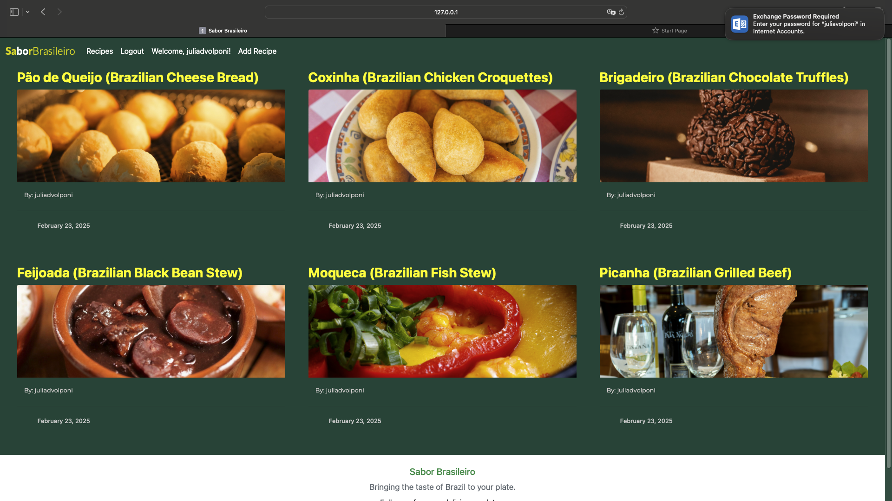
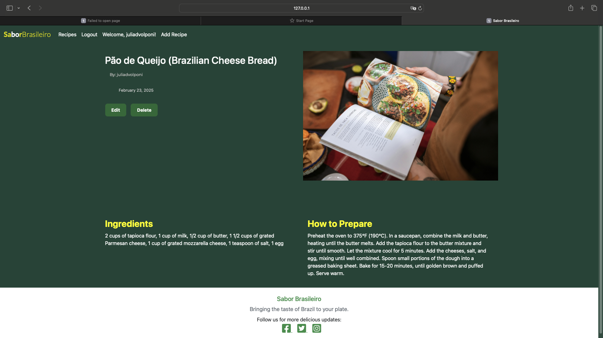
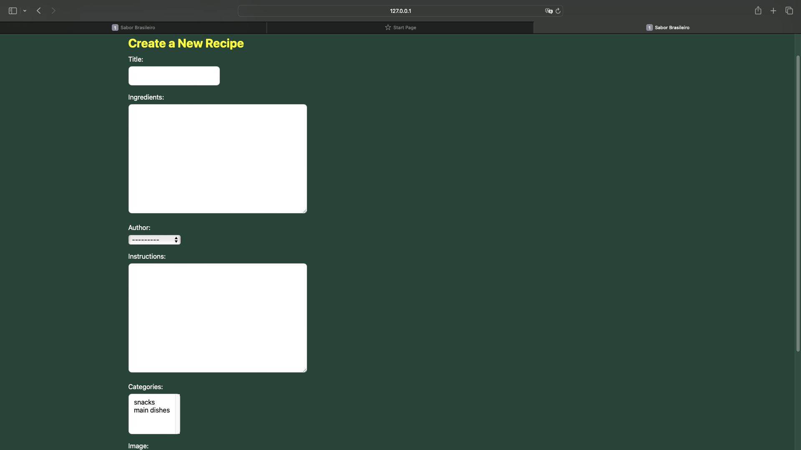
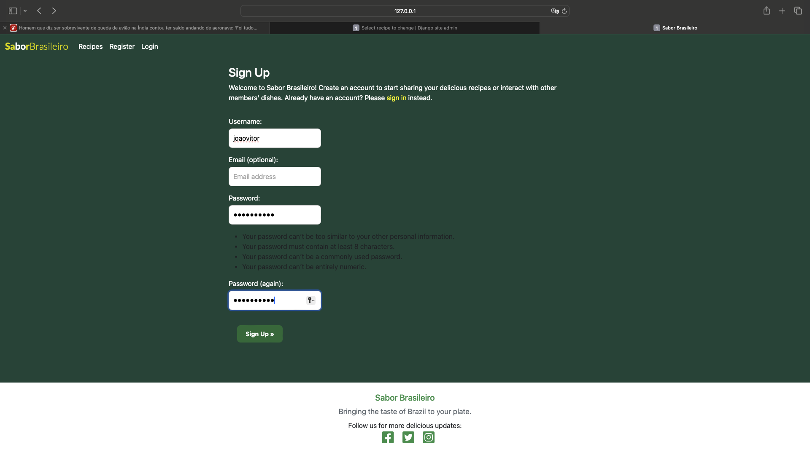
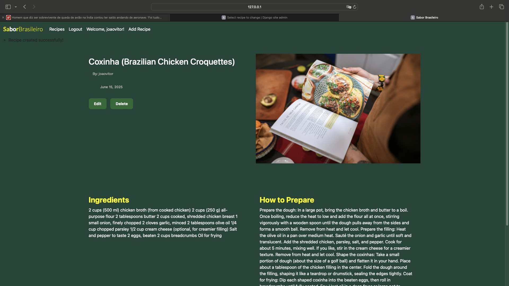
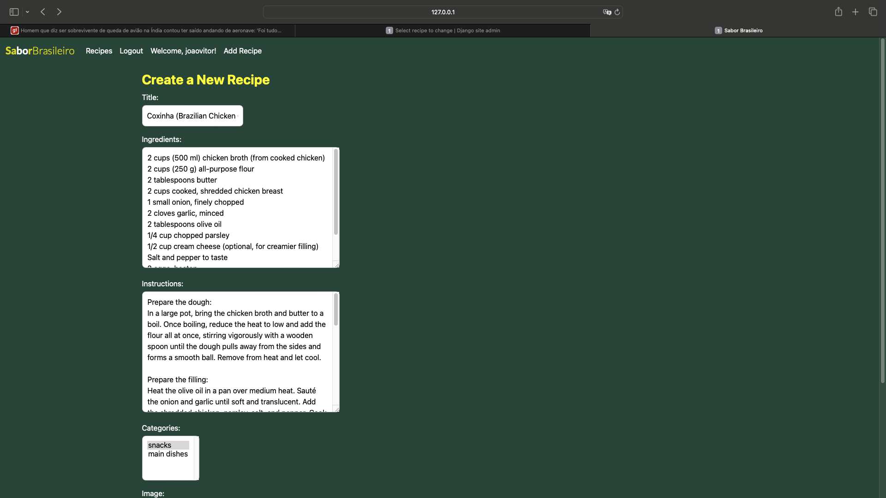

# Sabor Brasileiro - Brazilian Recipe Blog

### A Django-based web application for sharing and discovering authentic Brazilian recipes.

**Sabor Brasileiro**  
[Website](https://django-blog-saborbrasileiro-020999f88ab7.herokuapp.com/)

---

## Table of Contents

- [Project Overview](#project-overview)
- [Features](#features)
- [Technologies Used](#technologies-used)
- [Design](#design)
- [User Stories](#user-stories)
- [Testing](#testing)
- [Known Issues](#known-issues)
- [Deployment To Heroku](#deployment-to-heroku)
- [Credits](#credits)

---

## Project Overview

**Sabor Brasileiro** is a blog-style web application built using Django, designed for Brazilian food enthusiasts. Users can sign up, log in, and create, update, and delete their own recipes. Visitors can explore a variety of recipes that showcase Brazilian cuisine, including ingredients and step-by-step cooking instructions.

---

## Features

### General Features
- **User Authentication**: Users can register, log in, and log out.
- **Create, Read, Update, Delete (CRUD)**: Authenticated users can create their own recipes, update them, and delete them.
- **Recipe Browsing**: All visitors can browse the recipe listings and view detailed recipe information, including ingredients and instructions.

### Specific Features
- **Recipe Categories**: Recipes are organized into categories for easy navigation.
- **Responsive Design**: The website is fully responsive, providing a seamless experience on all devices.
- **Slugs for SEO**: Recipes are accessible via user-friendly URLs based on the title (slugified).

---

## Technologies Used

- **Django**: Backend framework.
- **HTML5/CSS3**: Frontend structure and design.
- **Bootstrap**: For responsive design and UI components.
- **SQLite**: Default database for development.
- **Gunicorn**: Web server for deploying the app on Heroku.
- **PostgreSQL**: Database for production on Heroku.

---

## Design

Here are some design visuals that represent the layout and structure of the **Sabor Brasileiro** blog:

- **Homepage/Recipe List**  
    
  *This is the homepage where all recipes are listed, users can browse and view the recipe details.*

- **Recipe Detail Page**  
    
  *A single recipe page displaying ingredients, instructions, and author details.*

- **Create/Update Recipe Form**  
    
  *A form for adding and updating recipes with fields for title, ingredients, and instructions.*

### Color Scheme

The color palette of **Sabor Brasileiro** is inspired by the **Brazilian flag**. The key colors include:

- **Green**: #1B4D3E (for hover effects, background)
- **Yellow**: #FFFF33 (used for hover effects, titles)
- **White**: #FFF (footer, paragraphs)
- **Light Gray**: #F5F5F5 (used for secondary backgrounds)

### Typography

The font choices were made to ensure readability and simplicity:

- **Primary Font**: `Lato, sans-serif` (for head title)
- **Secondary Font**: `Montserrat, sans-serif` (for body)

---

## User Stories

1. **As a visitor**, I want to browse available recipes so I can explore Brazilian cuisine.
2. **As a registered user**, I want to log in so I can manage my recipes.
3. **As a logged-in user**, I want to create a new recipe so I can share my favorite Brazilian dish.
4. **As a user**, I want to edit or delete my own recipes so I can manage them efficiently.

---

## ✅ Testing

### Manual Testing Table

| Feature                   | Test Description                           | Expected Result                    | Actual Result | Pass/Fail |
|---------------------------|--------------------------------------------|------------------------------------|----------------|-----------|
| User Registration         | Register new user with valid credentials   | User account created               | Success        | ✅ Pass   |
| User Login                | Log in with correct credentials            | Redirect to homepage               | Success        | ✅ Pass   |
| Invalid Login             | Try logging in with wrong password         | Error message shown                | Error shown    | ✅ Pass   |
| Recipe Creation           | Add new recipe as logged-in user           | Recipe appears on homepage         | Success        | ✅ Pass   |
| Recipe Update             | Edit an existing recipe                    | Changes are saved and displayed    | Success        | ✅ Pass   |
| Recipe Deletion           | Delete a recipe                            | Recipe no longer listed            | Success        | ✅ Pass   |
| Image Upload              | Add image when creating a recipe           | Image displayed properly           | Success        | ✅ Pass   |
| 404 Page                  | Visit non-existent page                    | Custom 404 page is shown           | Success        | ✅ Pass   |
| Responsive Design         | Check mobile/tablet layout                 | Layout adjusts cleanly             | Success        | ✅ Pass   |

### Screenshots

#### 📝 Registration Test  


#### 🖼 Recipe Detail View  


#### 🧾 Recipe Form Submission  


### Validation Tools

- **HTML/CSS** validated using [W3C Validator](https://validator.w3.org/)
- **Python** linted using `flake8`  
  Run:  
  ```bash
  flake8 blog/views.py

---

## Known Issues

- **Styling Tweaks**: Some minor UI elements could be improved for better user experience.
- **Pagination**: Not currently implemented for large numbers of recipes.

---

## Deployment To Heroku 

The project was deployed to [Heroku](https://www.heroku.com). To deploy, please follow the process below:

1. Log in to Heroku or create an account.
2. Click "New" → "Create new app".
3. Enter a unique app name, choose a region, click "Create app".
4. In the "Settings" tab, reveal "Config Vars" and add necessary keys and values.
5. Add Buildpacks: Python (first), Node.js (second).
6. In the "Deploy" tab, connect your GitHub repo.
7. Click "Deploy Branch".

---

## Credits

I would like to express my deepest gratitude to **Code Institute** for providing such a comprehensive and well-structured Full Stack Developer course.

A special thank you to the **Code Institute Support Team** for their incredible support during challenging times.

I would also like to extend a huge thanks to my **mentor** Precious for always providing guidance.

This project would not have been possible without the support of everyone involved. Thank you for believing in me and for giving me the tools and confidence to succeed.

---


